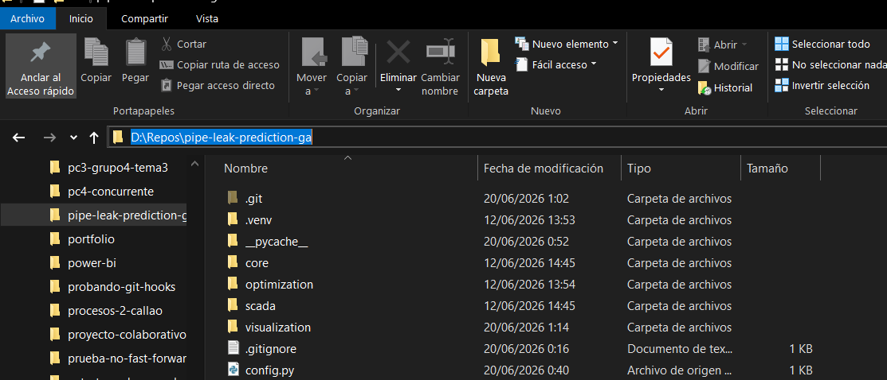

# Pipe Leak Prediction by Genetic Algorithm

Software para predecir fugas en oleaductos mediante algoritmos genéticos

### Cómo ejecutar el proyecto en tu computadora (Windows)

1. Descargar el código

* Ve al enlace de GitHub que te compartí.
* Haz clic en el botón verde que dice **`<> Code`** y selecciona **`Download ZIP`**.
* Ve a tu carpeta de Descargas, haz clic derecho sobre el archivo `.zip` descargado y selecciona **Extraer todo...** para descomprimirlo.

2. Instalar Python (Si no lo tienes)

* Descarga el instalador desde la [página oficial de Python](https://www.python.org/downloads/).
* Al abrir el instalador, hay un paso **muy importante**: en la primera pantalla, asegúrate de marcar la casilla que dice **`Add python.exe to PATH`** (Agregar Python al PATH) en la parte inferior antes de darle a "Install Now".

3. Abrir la consola en la carpeta del proyecto

* Entra a la carpeta que acabas de descomprimir (asegúrate de ver el archivo `main.py` ahí dentro).
* Haz clic en la barra de direcciones de la carpeta (arriba), borra lo que haya, escribe **`cmd`** y presiona **Enter**. Se abrirá una ventana negra de comandos exactamente en esa ubicación.

**4. Crear y activar el entorno virtual**
En esa ventana negra, copia, pega y ejecuta los siguientes comandos uno por uno (presionando Enter después de cada uno):

* Para crear el entorno:
  `python -m venv env`
* Para activarlo:
  `env\Scripts\activate`
*(Sabrás que funcionó si ahora ves un `(env)` al inicio de la línea de comandos).*

5. Instalar las dependencias
Con el entorno activado, instala las herramientas que necesita el proyecto ejecutando:
`pip install -r requirements.txt`

6. Ejecutar el código
Finalmente, arranca el programa con este comando:
`python main.py`
